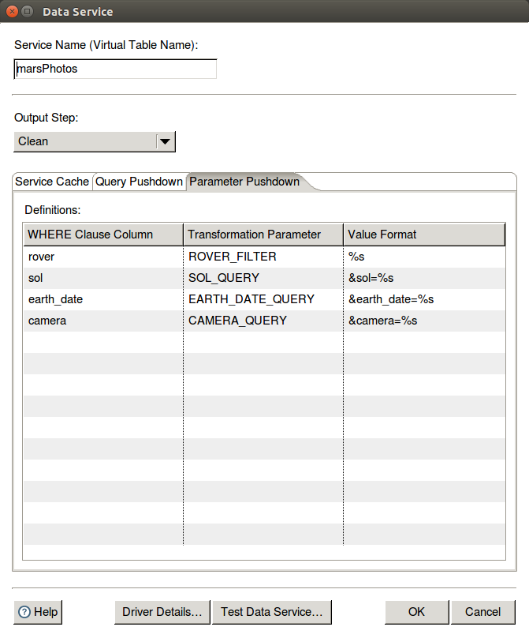
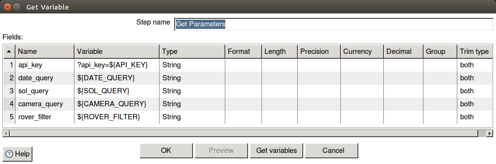
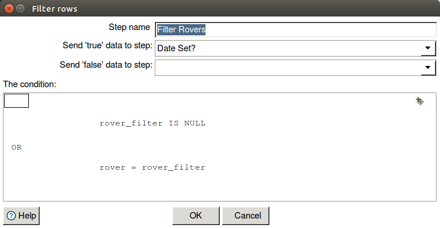
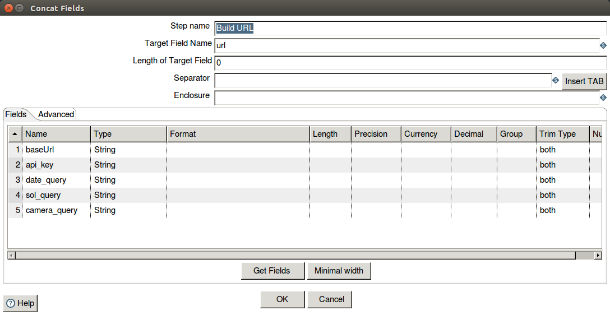

# Data Services Technical Overview

## Table of Contents
0. [Use Cases](#use-cases)
0. [How it Works](#how-it-works)
0. [ETL Designer Guide](#etl-designer-guide)
  * [Testing](#testing)
  * [Optimizations](#optimizations)
  * [Hosting](#hosting)
0. [User Guide](#user-guide)
  * [SQL Queries](#sql-queries)
  * [PDI](#pdi)
  * [Analyzer Modeling](#analyzer-modeling)
  * [General Mondrian Usage](#general-mondrian-usage)
  * [Reporting](#reporting)
     * [PRD](#prd)
     * [PIR](#pir)
     * [CTools](#ctools)
  * [External Tools](#external-tools)
  * [Multi-tenancy](#multi-tenancy)
0. [Limitations](#limitations)
0. [Troubleshooting](#troubleshooting)

## Use Cases
Pentaho Data Services enables users to access data with the ease of use and standard skillset of the SQL query language, while also leveraging the power and complexity of a Pentaho Data Integration transformation.

A standard use case that has driven the development of Pentaho Data Services is to easily serve the Data Scientist who would like access to data in an analytics tool like Tableau or R Studio, but doesn’t want to struggle with the heavy lifting of cleansing the data, blending it, dealing with IT security concerns, etc. A transformation is developed as a Data Service, and then exposed through a DI Server, giving the Data Scientist easy access to data through his/her favorite tools via standard JDBC.

Data Services is a candidate for data preparation and service to the embedded and OEM solutions that many of our customers craft. Data Services can replace CDA, or be leveraged through CDA, in some solutions where the queries are consistently querying the same table of data, with filtering and sorting (as examples) as primary capabilities for the embedded solution. This is a prime use case, as the improvements to query and parameter pushdown now optimize for these capabilities.  

Data Services can be used where any standard JDBC connection can be used to deliver data. You can use Data Services as a source to Pentaho Reporting, Analytics, as a service in another PDI job or transformation. See documented boundaries for the Pentaho suite of tools below. Performance can b improved using optimizations, and mileage will vary.

The Streamlined Data Refinery, with improvements made to PDI’s auto-model and auto-publish capabilities, can now be used to automate the creation and publishing of new Data Services.  This allows IT to give end users a self-service capability for complex data sources. The transformation developer can design a Data Service on the auto-model step, publish this Data Service and model, and have a streamlined solution for data extraction and analytics that can be on-demand. Pushdown query and parameter optimizations have been improved and can mitigate some latency in this use case, but consideration must still be given to the size of the dataset queried and the on-demand expectation of the data delivery. Carefully review the limitations sections in this document for boundaries on when to use this solution.  Many of the improvements made in the latest release were driven from the BioMe demonstration, which is a sample SDR solution.

## How it Works

Data Services is implemented as a set of OSGi plugins and is included in all core Pentaho products. It allows data to be processed in Pentaho Data Integration and used in another tool in the form of a virtual table.

Any Transformation can be used as a virtual table. Here's out it works:
  0. In Spoon, an ETL designer [creates a Data Service](https://help.hitachivantara.com/Documentation/Pentaho/10.0/Products/Pentaho_Data_Services#Creating_a_regular_or_streaming_Pentaho_Data_Service) on the step which will generate the virtual table's rows.
  0. Metadata is saved to the transformation describing the the virtual table's name and any optimizations applied.
  0. On saving the transformation to a repository, a table in the repository's MetaStore maps the virtual table to the transformation in which it is defined. A DI Server must be connected to this repository and running for any Data Services to be accessible.
  0. A user with a JDBC client [connects to the server](https://help.hitachivantara.com/Documentation/Pentaho/10.0/Products/Pentaho_Data_Services#Connect_to_the_Pentaho_Data_Service_from_a_Pentaho_tool). The client can list available Data Services (virtual tables), view table structure, and submit SQL SELECT queries.
  0. When the server receives a SQL query, the table name is resolved and the user-defined **Service Transformation** is loaded from the repository. The SQL is parsed and a second **Generated Transformation** is created, containing all of the query operations (grouping, sorting, filtering).  
  0. Optimizations may be applied to the Service Transformation, depending on the user's query and constraints of the optimization type. These optimizations are intended to reduce the number of rows processed during query execution.
  0. Both transformations execute. The service transformation will only execute those steps necessary to produce rows from the selected step.  Output from the service transformation is injected into the generated transformation, and output of the generated transformation is returned to the user as a Result Set.

A vast majority of the work here is done by the [pdi-dataservice-server-plugin](https://github.com/pentaho/pdi-dataservice-server-plugin). It is located in Karaf assembly in data-integration and data-integration-server.

The [pdi-dataservice-client-plugin](https://github.com/pentaho/pdi-dataservice-plugin/tree/master/pdi-dataservice-client/) contains the code for connecting to a server, issuing queries, and receiving result sets. It also contains the [DatabaseMetaPlugin](https://github.com/pentaho/pdi-dataservice-plugin/blob/master/pdi-dataservice-client/src/main/java/org/pentaho/di/trans/dataservice/client/DataServiceClientPlugin.java) which adds 'Pentaho Data Services' as a supported database connection type. It is included in the karaf assemblies of all supported Pentaho products and can be added to the classpath (along with a few dependencies) of other tools using JDBC connections.

## ETL Designer Guide

Although any transformation step can be used as a Data Service, it is highly recommended that a transformation contains only one data service and that running the transformation has no persistent side-effects. When using data services with an OLAP engine like Mondrian, many SQL queries may be issued, and the entire transformation may run each time. There is no guarantee when or if a service transformation will execute. Transformations usually consist of inputs combined into one Select Values or Dummy Step.

### Testing

Data services can be tested directly within Spoon. After creating the data service, use the test dialog to run test queries [(see help)](https://help.hitachivantara.com/Documentation/Pentaho/10.0/Products/Pentaho_Data_Services#cp_pentaho_test_a_pentaho_data_service_pentaho_data_services_pdi).

It is also highly recommended to save the transformation to a DI server and test the service from a [new database connection](https://help.hitachivantara.com/Documentation/Pentaho/10.0/Products/Pentaho_Data_Services#Connect_to_the_Pentaho_Data_Service_from_a_Pentaho_tool) within Spoon. This will ensure that any resources used by the transformation will be accessible when executing remotely.

### Optimizations

Data service optimizations should be configured once the data service has been tested and output is verified.

Optimizations should never alter the output of a service. They are designed only to speed up data services by reducing the number of rows being processed. They are also designed to execute in a 'best-effort' fashion. If criteria for an optimization is not met, no changes will be made.

#### Caching

Caching is designed to run the Service Transformation only once for similar queries. When enabled, the output of the user-defined Service Transformation will be stored in a timed cache before being passed to the Generated Transformation.

On subsequent queries, this optimization will determine if the cache holds enough rows to answer the query. If it does, the Service Transformation will not run. Rows will be injected into the Generated Transformation directly from the cache. A Generated Transformation will always be created and run for each query.

Caching is enabled by default when a Data Service is created. The timeout for a cache (TTL) can be configured on a per-service basis within Spoon. There is no option today to explicitly clear the cache, but disabling the cache and running the transformation will clear the cache.

Depending on system resources and the size of the service output, [cache limits](#result-set-size) may be reached and performance will degrade severely.

#### Query Pushdown

Query Pushdown should be used when a service imports rows form an 'Table Input' or 'Mongo Input' Step. Use the [help pages](https://help.hitachivantara.com/Documentation/Pentaho/10.0/Products/Optimize_a_Pentaho_Data_Service) to configure a Query Pushdown optimization.

This optimization will analyze the WHERE clause of an incoming query and push parts of the query down to an input step. The query fragment will be reformatted as SQL or JSON, depending on the input step type.

A Query Pushdown optimization can not be used if values are modified between the input step and the service output step (e.g. Calc, Group By). Filtering, adding additional fields, merging with other rows, and altering row metadata is allowed and can be optimized.

#### Parameter Pushdown

Parameter Pushdown requires special consideration when designing as Service Transformation

Mappings are configured to correlate virtual table columns to transformation parameters. When a query contains a simple `COLUMN = 'value'` predicate in the WHERE clause, the corresponding transformation parameter is set to `value`. A formatting string can optionally be modified to add a prefix or postfix to the value. A default value can be set from the Transformation Properties dialog.

When designing the transformation, be careful of the case where the parameter may be empty, meaning the query was not optimized. For example, consider the [marsPhoto sample transformation](https://github.com/pentaho/pentaho-engineering-samples/tree/master/Product%20Samples/Pentaho_Data_Integration/Transformations/mars.ktr)

These parameters are injected into the row stream via a Get Variable Step

The `ROVER_FILTER` parameter is applied with a Filter Step. If the parameter is null, the filter could not be optimized and all rovers are queried.

The Value Format in the optimization configuration allows the `*_QUERY` parameters to optimize and HTTP request. A Concat Strings step is used to append the parameters to the end of the base URL.

### Hosting

The recommended means of publishing a Data Service is running a **DI Server**. Connect Spoon to the Pentaho Repository of a DI Server and save a transformation with a Data Service. The service will automatically be published to the DI Server and available to connected JDBC clients.

Data Services can also be hosted from a CE/EE **Pentaho Server**. Connect to the server repository as you would and save the transformation. Note that when creating a database connection to a Pentaho Server, "web app name" should be changed to "pentaho" and the default port is 8080.

**No further configuration is required to the DI Server.** This differs from releases prior to 6.0, where an admin would have to modify the server's `slave-server-config.xml`. Starting with 6.0, users will automatically connect to the server's built-in repository and inherit the execution rights of the current session. JDBC users connected in this manner will only be able to query a data service if they would normally have execution rights for the respective transformation.

Although not recommended, it is possible to configure a DI Server to use an alternative repository by adding a `repository` element to `data-integration-server/pentaho-solutions/system/kettle/slave-server-config.xml`

Hosting Data Services from **Carte** is not yet officially supported.

## User Guide

### SQL Queries
Data Services support a limited subset of SQL.  The capabilities are documented here: [10.0](https://help.hitachivantara.com/Documentation/Pentaho/10.0/Products/Pentaho_Data_Service_SQL_support_reference_and_other_development_considerations)

**Some important things to keep in mind:**
- Calculations are *not* supported.  This impacts things like Mondrian’s native filter and topcount since it will attempt to push down simple filter calculations to the database (see above).
- Aggregate functions can give incorrect results when NULLs are included in the results.  For example, min/max will include NULLs in the results, where the SQL spec says they should be excluded ([PDI-14974](http://jira.pentaho.com/browse/PDI-14974), [PDI-14422](http://jira.pentaho.com/browse/PDI-14422))
- Fields cannot be referenced with the “kettle” schema (e.g. “Kettle”.”Table”.”Field”).  ([PRD-5560](http://jira.pentaho.com/browse/PRD-5560))
- Nested selects are not supported
- No table joining is supported.  Data Services only work with single tables.

### PDI
**Data Refinery** Pentaho Data Services make a good datasource for use in the Data Refinery.  The Build Model job step is able to select from data services that are defined in any of the transformation steps that are connected in your job.  The Annotate Stream transformation step is a good choice for where to attach your data service.  Your transformation will be run twice in the typical data refinery setup.  The first time is from the flow of the main transformation, and the second time as a result of the Build Model step connecting to the service for modeling.  This is important to know for troubleshooting when you are connected to a remote repository and running the job locally.  The job runs once locally and once remotely.  In this case, make sure you aren't refencing any local files.  The Publish Model job step will publish a JDBC connection to the BA Server using the URL from the Pentaho Repository you are connected to.  Publish will fail if you are not connected to a Pentaho Repository since the data service would not be accessible outside your local session.

### Analyzer Modeling
**Star Schemas** Analyzer and Mondrian typically use a Star Schema, where there are separate tables for facts and dimensions.  Pentaho Data Services do not support joining multiple transformations together.  This means you will have to model your schema against one flat table.

**Parent-Child Hierarchies** Parent-child hierarchies usually require a closure table to have adequate performance. Since closure tables also require a SQL join, you cannot use them in your schema backed by a Pentaho Data Service  Therefore, we recommend against creating any Parent-child hierarchies for all but the smallest of data sets.

**Aggregate Tables** Aggregate tables are allowed in your schema, of course you still cannot link to any dimension tables.  Each aggregate table needs to be defined as separate transformation with the attached data service.  You may use PDI's included steps for grouping and sorting to build your aggregate transformation.  You may also choose to configure your data input step to do the aggregation at the source.  MDX queries that are able to utilize your aggregate table will do so when querying for cell data, but queries for member data will not use the aggregate table.

**Modeling Tools** You may use any of your usual tools for creating a Mondrian schema.  Pentaho Schema Workbench, Data Source Wizard, PDI Annotations or manual schema creation can all generate valid schemas for use with Pentaho Data Services.  Keep in mind the limitations as descrbed here.  For example, because you may not use a Star Schema, the Shared Dimension annotation would generate an invalid schema for a Pentaho Data Service connection.

**Mondrian Properties** If your schema defines calculated measures that use any arithmetic operations in the calculation, then you will need to disable the native filter option in Mondrian.  For example, if your measure computes an average by dividing a sum measure by a count measure, then that measure will cause SQL failures when used on a report, unless you disable native filter.  The option is specified in mondrian.properties with the name "mondrian.native.filter.enable".

### General Mondrian Usage

In addition to the Mondrian schema limitations referenced in the previous [section](#analyzer-modeling), there are some other factors to be aware of when using Data Service connections with Mondrian:

* XMLA connections are not currently supported.  This is due to a certain form of cardinality query that gets executed by Mondrian when collecting XMLA metadata.  Work to implement a custom dialect for Data Services has been proposed which would prevent this unsupported cardinality query from being executed ([BACKLOG-6872](http://jira.pentaho.com/browse/BACKLOG-6872)).  Most other places where this form of SQL would be executed by Mondrian are not applicable to use of Mondrian with Data Services (e.g. with shared dimensions in certain member constraint queries).

* There are certain scenarios where Mondrian will issue a WHERE clause with a literal comparison, like "WHERE (1 = 0)".  These constraints are not supported by Data Services ([BACKLOG-6870](http://jira.pentaho.com/browse/BACKLOG-6870)).  The most common place where this happens is with native tuple queries with virtual cubes, which is not applicable to Data Services.  One place where such queries *can* happen with data services, however, is if the MDX includes an empty set.  For example "SELECT NonEmptyCrossJoin(  {}, Time.Year.members) on 0 from cube".  This should be a relatively rare occurrence, but if errors are caused by such WHERE constraints an ugly workaround is to define dummy fields in the service trans named "1" and "0".

### Reporting

#### PRD

For the most part, PRD reports will work well with Data Services. Parameterized reports in particular can benefit from the optimization features of Data Services:

**Query Pushdown.**  If the underlying datasources in a Data Service include Table Input or MongoDB Input, Query Pushdown optimizations will allow the PRD parameters selected within the report to be pushed down to the source data.  This can greatly limit the amount of processing the service needs to perform.  Query Pushdown can handle relatively complex WHERE clauses, and can work well with both Single-Select style PRD parameters as well as Multi-Select.

**Parameter Pushdown.**  For other input sources (e.g. a REST input), Parameter Pushdown can be leveraged to make parameterized PRD reports more efficient.  Single values selected within one or more report parameters can be pushed down and used to limit the underlying data source.  Note that this won’t work with Multi-Select parameters, since Parameter Pushdown does not support IN lists.

There are two current limitations to be aware of when creating PRD reports.

1.  When defining your SQL query, the SQL Query Designer is able to load and display the virtual tables and fields available from a data service.  The field names set in the editor, however, use the full path (e.g. "Kettle"."VirtualTable"."VirtualField").  Data Services SQL does not support prefixing the “Kettle” schema name within column references ([PRD-5560](http://jira.pentaho.com/browse/PRD-5560)).  The workaround is to manually edit the query to remove the “Kettle”.

2.  Including parameters in your query can cause design-time issues, since PRD will place NULL values in parameters when doing things like preview or listing the available columns in the Query tree in the Data Sets pane ([PRD-5662](http://jira.pentaho.com/browse/PRD-5662)).  The workaround is to not use parameters while doing report design, swapping them in at the point you’re ready to test the report locally or publish.  This design time limitation should not impact successful execution of reports with parameters.

The one place limitation (2) above can have runtime impact is if the PRD parameter is set to "Validate Values" and can have a NULL (or N/A) value.  PRD will attempt to validate by passing a NULL in the JDBC call, which hits the same error as [PRD-5662](http://jira.pentaho.com/browse/PRD-5662) describes.  This error doesn't actually prevent running the report, but does display a validation error below the prompt.

Another potential “gotcha” with PRD/Data Services report construction is that the datatypes from the transformation in the data service may not translate to what you expect in the virtual table.  For example, an Integer field in a transformation will be widened to a Long in the result set.  Make sure to check the datatype as displayed in the Data Set tree when defining parameter datatypes.

Also, virtual table names in SQL are case sensitive, so make sure to match the casing from the defined service.

#### PIR

Interactive Reporting models for use with Data Services can be created both with the Data Source Wizard and with Metadata Editor.  Be aware that if using Data Source Wizard you must select “Database Tables” and cannot define a SQL query for the source.  This is because DSW will wrap any SQL specified as a sub-select, and the Data Services SQL parser is not currently capable of handling such queries.  The error when attempting to use SQL is not particularly helpful, either:  “Unable to generate model:  null”.  [BISERVER-13064](http://jira.pentaho.com/browse/BISERVER-13064)

Models can be created using Pentaho Metadata Editor as well, with the limitation that no joins can be defined (since Data Services supports querying only a single table).

As with PRD reports, including report parameters can make performance optimizations with Query Pushdown and Parameter Pushdown very effective ([see above](#prd)).

#### CTools

There hasn't been extensive testing of Data Services with CTools but in general a virtual table exposed through Data Services should function as a jdbc data source.  Connecting via both "sql over jndi" and "sql over jdbc" are current options for connecting to a Data Service.  Future proposed work will add Data Services as a new datasource type available from CDE ([BACKLOG-6644](http://jira.pentaho.com/browse/BACKLOG-6644)).

Keep in mind that any SQL used with a CDA connection to Data Services needs to conform to the limited subset described [above](#sql-queries).

### External tools

While there has been no full validation of any external JDBC clients with Data Services, some have been used without any identified issues.  For example, [SQuirreL](http://squirrel-sql.sourceforge.net/), [RStudio](https://www.rstudio.com/home/), and [SQLLine](https://sourceforge.net/projects/sqlline/) have all been used by the development team successfully.  

Be aware, however, that some external tools are likely to hit issues with Data Services handling of JDBC metadata.  There are some metadata methods which are not currently implemented, which can cause unexpected errors.  [Aqua Data Studio](http://www.aquafold.com/), for example, is not completely usable with Data Services due to such limitations.

### Multi-tenancy

Many of the [techniques](https://help.hitachivantara.com/Documentation/Pentaho/10.0/Developer_center/Multi-tenancy) used to support multi-tenancy should transparently work with Data Services.  For example, when using a "sharded" approach to managing a multi-tentanted environment, each tenant will have its own Data Service.  Custom logic can then be used to map a user's session information to the Data Service connection appropriate for a given tenant.  

For Analyzer, Dynamic Schema Processors can similarly be used to enforce limited views of a Data Service in much the same way as with ordinary relational databases.  By adding templated &lt;SQL&gt; in the &lt;Table&gt; tag of the Mondrian schema for the Data Service virtual table, a dynamic schema processor can ensure that an appropriate tenant contraint is included in each WHERE clause issued to the Data Service.  

## Limitations
#### Result Set size

The caching optimization is designed to store and retrieve result sets to bypass execution of the Service transformation. The entire result set must be kept in memory when a query is executing. If a large number of rows are expected from a Data Service, and the total result set size is expected to exceed the cache's for JVM's allocated memory, execution may fail.

Kettle starts with a maximum 2GB heap size by default. Disabling caching is recommended when result sets are expected to exceed 1GB in size.
*TODO: More performance testing*

Caching can be disabled from the Data Service dialog in Spoon. This will ensure that the transformation runs for every query, but memory usage is kept to a minimum.

This issue may be partially resolved when cache persistence is supported. ([BACKLOG-2835](http://jira.pentaho.com/browse/BACKLOG-2835)) Additional development work will be needed to stream results from cache. ([BACKLOG-6874](http://jira.pentaho.com/browse/BACKLOG-6874))

## Troubleshooting
The help [docs](https://help.hitachivantara.com/Documentation/Pentaho/10.0/Setup/Data_integration_issues#Troubleshoot_Pentaho_data_service_issues) have some good suggestions for troubleshooting basic issues.  Some additional things to keep in mind:

When troubleshooting a data service, running within the Data Service Test dialog is the simplest way to collect information about what’s going wrong, since it allows viewing DEBUG level logging of both the Generated and Service transformation.  Often the errors from one or both of these logs will identify the cause of a failure.

If you encounter errors when executing your data service remotely which you did not see when running within the Data Service test dialog, one of the first things to do is to *verify that all resources required by the service are available to the server.*  For example, if you are using a CSV input file, make sure that the path to the CSV file is accessible from di-server.

Reviewing the di-server logs can provide additional information about the failure.  Typically the error information returned to the jdbc client will be fairly generic, but the server logs should provide more detailed information and stack traces connected with the failure.

Additionally, setting the debugtrans connection parameter will allow you to write out the generated transformation to a location you specify.  Being able to review the generated transformation can occasionally identify the cause of problems (see the “Required Parameters” section of [Connect to a Pentaho Data Service](https://help.hitachivantara.com/Documentation/Pentaho/10.0/Products/Pentaho_Data_Services#Connect_to_the_Pentaho_Data_Service_from_a_Pentaho_tool))

One issue that can occur under heavy usage with data services is that a large amount of memory can be consumed, eventually leading to OOM if intensive enough.  This can happen because generated transformations used when executing SQL will be kept around until the cleanup thread removes them, which by default only happens every 4 hours.  If Data Services will be frequently queried, the cleanup job interval should be adjusted to accommodate by setting the KETTLE_CARTE_OBJECT_TIMEOUT_MINUTES property.  [PDI-14491](http://jira.pentaho.com/browse/PDI-14491) is intended to address the flood of carte objects that can occur.
